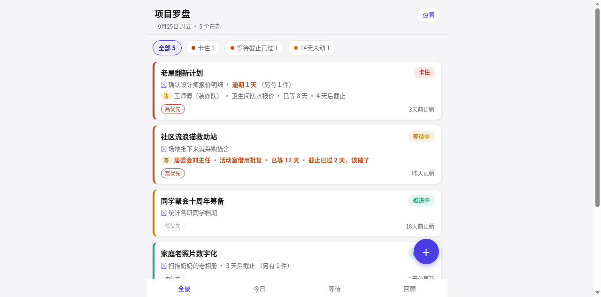
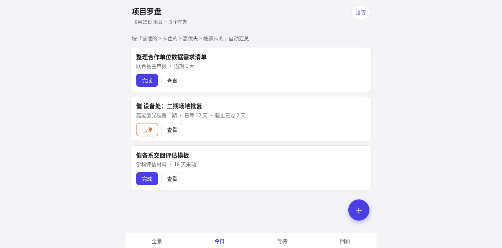
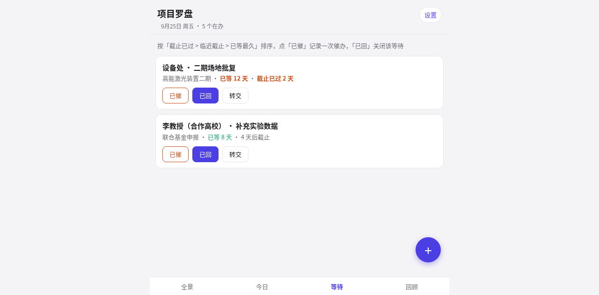
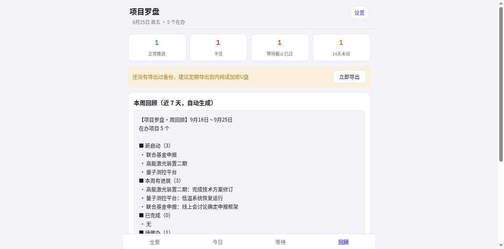

# 项目罗盘 Project Compass

为「几十个项目并行」设计的轻量个人项目管理工具：一屏看清全部项目、10 秒更新状态、自动揪出该催的和被遗忘的。

**零网络 · 零账号 · 数据只存在你的手机里**（APK 无网络权限，物理断网可用）

## 界面

| 全景 | 今日 |
|:---:|:---:|
|  |  |

| 等待 | 回顾 |
|:---:|:---:|
|  |  |

## 它解决什么问题

同时推进几十个项目的人，大概都遇到过：

- 一堆事在等别人回复，等着等着就忘了；
- 卡住的项目沉底，两周没碰也想不起来；
- 分不清今天最该推哪件事。

项目罗盘把每个项目压成一张卡片：状态徽标点一下就切换；事项与等待事项自动计算逾期、该催、临近截止；「今日」页每天排好 ≤5 件最该动的事；「回顾」页自动生成周报雏形。

## 下载安装（Android 7.0+）

1. 到 [Releases](../../releases) 下载最新 `project-compass-v2.0.apk`（附件名仅支持英文，即「项目罗盘 v2.0 安卓安装包」）；
2. 手机上点开安装，允许「未知来源应用」；
3. 装好即用。

**权限仅两项**：通知（每日早报）、开机启动（重启后恢复早报）。**无网络权限**——数据没有外传的通道，可开飞行模式验证，一切功能照常。

### 每日早报

可开关、可调时间（默认 08:00）：逾期 N 项 · 该催 N 项 · 3 天内截止 N 项，附最要紧的 3 条明细，点通知直达今日页；无事时轻声说一句「安心推进」。

## 网页版（免安装备选）

不想装 APP？直接用仓库里的 `项目罗盘.html`：手机/电脑 Chrome 打开 → 菜单 →「添加到主屏幕」。功能与 APP 一致，仅两处差异：无系统级早报、数据存于浏览器（清除浏览器数据会丢失）。两种形态的备份文件完全通用，可互相导入。

## 从网页版迁移到 APP

1. 网页版：设置 →「导出备份文件」；
2. APP：设置 →「导入备份」，选择该文件；
3. 核对项目数量无误，完成。

## 从源码构建

需要 JDK 11+、Android SDK（platform 33 / build-tools 33.0.2）、Gradle 7.6+。

```bash
cd android
# 生成自己的签名密钥（勿提交，务必备份；密钥丢失 = 已装用户无法升级）
keytool -genkeypair -keystore release.keystore -alias compass \
    -keyalg RSA -keysize 2048 -validity 10000
cat > keystore.properties <<'EOF'
storeFile=release.keystore
storePassword=你的密码
keyAlias=compass
keyPassword=你的密码
EOF
gradle assembleRelease
# 产物：app/build/outputs/apk/release/app-release.apk
```

网页版本体是 `项目罗盘.html` 单文件，无任何依赖与构建步骤。

## 目录结构

```
项目罗盘.html     # 应用本体（单文件 HTML+CSS+JS，107 项回归测试）
android/          # APP 壳（手写 WebView 壳，无第三方依赖）
docs/             # 设计文档、截图、发布说明
使用说明.md       # 详细使用手册
```

## 声明

个人业余项目，不收集任何数据（也没有收集的能力）。源码仅供学习交流，欢迎提 issue。
